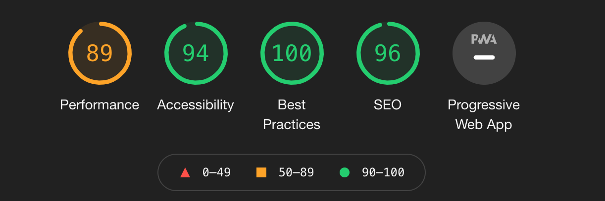

# Marco Gabarron's Portfolio
Website developed to show Marco Gabarron's portfolio. Website includes Main landing page, projects page and contact me page.
User will find my most recent projects using HTML, CSS, JavaScript and Swift.

## Purpose
------

Purpose of this project is to showcase my abilities in HTML and CSS to accomplish project 1 of Code Institute course. 
Project was chosen in order to use it to showcase my projects portfolio in the future for potential employers.

## UX design
------

Ux design developed to be mobile first and user friendly.
Fonts and color Pallet chosen to be playful and easy to read.
Navbar and footer kept the same throughout the website to keep consistency.
Headings and paragraphs text color kept the same on all pages

- Index Page
    - Landing page designed to have a bit of text but have all the content user needs to know.
    - Profile section designed to show my profile picture and a quick hello.
    - My skills section designed to be simple and fun but also providing user with my skills.
    - Get in touch section designed to give user another link to contactme page.

- Projects Page
    - Projects page designed to showcase my propjects with a simple description and an image or logo that represents the project.
    - Colors kept the same of other pages.

- Contactme Page
    - Contactme page designed to have a form where user can send me a message having to provide their full name, email and message.
    - Form designed to change color when user hovers one of the fields.
    - Send Button designed to change color the hovered.
    - Colors kept the same of other pages.

## Features
------

- Navigation:  
    - Name on Top left corner.
    - Navigation Menu on top right Corner containing Home, Projects and Contact Me links.
    - Font chosen to be a handwritting font on headers and neutral and easy to read font on links and menus.
    - Navigation made to be clear and easy section divisions.

- Profile Section: 
    - Image to ilustrate what is the theme of the portfolio(coding).
    - Hero image followed by profile picture and a Hello message.
    - This section provides a clear understanding of what the website is about(Portfolio) and main focus(Developer)

- My Skills Section: 
    - Add image to ilustrate and easily identify skill.
    - Brief Description of my skills.
    - Color of images and text to match the pallet color of the rest of the website.
    - Idea is to be playful and give more details in Projects page.

- Get in Touch Section:
    - Brief and nice message to invite user to get in touch with me.
    - Highlight that there is a Contact Me page.
    - Button with link to Contact Me page.

- Projects Page:
    - Description of Projects Done.
    - Listed technologies used.
    - Added logo image that represents project.

- Contact Me Page:
    - Added form for user to get in touch.
    - Name, Surname, Email field input added and textarea included for a Message entry.
    - Whe clicked, send button will bring you to CI form validator.

## Testing
------

- Website tested with two different browsers(Chrome, Firefox).

- Responsiveness of website tested and can confirm it is retaining design and readability on all screen sizes.

- I confirmed Home, Projects and Contact Me page are readable and easy to unsderstand.

- Links in the Navbar working properly and having expected behaviour.

- Confirmed all input fields are working properly and expecting apropriate format(Email format for instance).

### Bugs

##### Solved Bugs

- My skills section in the home page was breaking when on mobile screen. Had to change style.css to proportional size. Used "@media screen and (max-width: 1200px)" to re-style section.

### Validator Testing
- HTML: 
    - No errors were returned when passing through the official W3C validator.

- CSS: 
    - No errors were returned when passing through the official (jigsaw)) validator.

- Acessibility
    - I confirmed that the colors and fonts chosen are easy to read and accessible by running through lighthouse in devtools.

### Unfixed Bugs
No unfixed bugs

## Deployment
------

- The site was deployed to GitHub pages. The steps deploy are as follows:
    - In the GitHub repository, navigate to the Settings tab.
    - From the source section drop-down menu, select the Master Branch.
    - Once the master branch has been selected, the page provided the link to the completed website.

The live link can be found here: <a href="https://marco-gabarron.github.io/marco-gabarron-resume/" target="_blank">Marco's Protfolio</a>

## Future Developmets
------

- Add more projects to Projects page and include links to them live.
- Add animations to the website. 
- Add functionality where message sent through contactme page is sent to my email.

## Credits
------

### Content
- The code to make social media links were taken from CI Love Running projects.

### Media
- Code Image and my skills images taken from <a href="https://pexels.com" target="_blank">Pexels.</a>
- Icons for social media links in the footer taken from <a href="https://fontawesome.com" target="_blank">Font Awesome.</a>.
- 6 fonts(Merriweather, Sacramento, Rubik, Montserrat, Lato and Oswald) used throughout the project taken from <a href="https://fonts.google.com/" target="_blank">Google Fonts.</a>